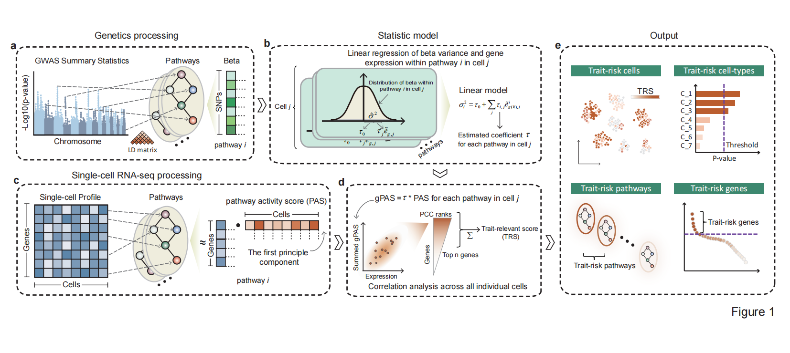

```{r, include = FALSE}
knitr::opts_chunk$set(
  collapse = TRUE,
  comment = "#>",
  fig.path = "man/figures/README-",
  out.width = "100%"
)
```

# About scPagwas

**scPagwas** employs a polygenic regression model to prioritize a set of trait-relevant genes and uncover trait-relevant cell subpopulations by incorporating pathway activity transformed single-cell RNA sequencing (scRNA-seq) data with genome-wide association studies (GWAS) summary data.



We are preparing to release an upgraded version of scPagwas, named scPagwas2, which introduces enhanced methods for calculating genetically associated genes. By incorporating extensive random calculations, this version offers improved result stability. Additionally, we have addressed issues with synchronizing results across single-cell data and cell-type data. Please note that scPagwas2 requires the use of the scPagwas_main2 function to replace the original scPagwas_main.

To accommodate the substantial memory demands of single-cell data calculations in R, we have developed a Python version, scPagwas_py (https://github.com/dengchunyu/scPagwas_py), fully synchronized with scPagwas2.0. We will continue to provide updates to further enhance computational efficiency.

Please cite this article in press as: Ma et al.,Polygenic regression uncovers trait-relevant cellular contexts through pathway activation transformation of single-cell RNA sequencing data,Cell Genomics (2023),https://doi.org/10.1016/j.xgen.2023.100383


Code for reproducing the analysis from the paper is available [here](https://github.com/dengchunyu/scPagwas_reproduce), or [](https://doi.org/10.5281/zenodo.8137370)

For further usage on the scPagwas package, you can visit the  [website](https://dengchunyu.github.io/about/). A vignette for using also can be accessed using browseVignettes("scPagwas")

## Installation

You can install the released version of scPagwas from [github](https://github.com/sulab-wmu/scPagwas) with: 

``` r
#install some dependence packages
install.packages("Seurat")#‘5.0.3’
install.packages("ggpubr")
if (!require("BiocManager", quietly = TRUE))
    install.packages("BiocManager")
BiocManager::install("GenomicRanges")

devtools::install_github("WMU-SuLab/scPagwas")
```

In many cases, installing packages using `devtools::install_github` may fail. 

```r
library(devtools)
install_git("https://github.com/WMU-SuLab/scPagwas.git", ref = "main")
```


## Usage 
quick-start example: 
```{r message=FALSE, eval = FALSE}
library(scPagwas)
system.time(
 #1.start to run the wrapper functions for example.
 Pagwas_data<-scPagwas_main2(Pagwas = NULL,
                     gwas_data =system.file("extdata", "GWAS_summ_example.txt", package = "scPagwas"), # The GWAS Summary statistics files 
                     Single_data =system.file("extdata", "scRNAexample.rds", package = "scPagwas"),# scRNA-seq data in seruat format with "RNA" assays and normalized.
                     output.prefix="test", # the prefix name for output files
                     output.dirs="scPagwastest_output",# the directory file's name for output
                     block_annotation = block_annotation_hg37,# gene position in chromosome is provided by package. default is hg38, block_annotation_hg37 is hg37.
                     assay="RNA", # the assays for scRNA-seq data to use.
                     Pathway_list=Genes_by_pathway_kegg,# pathway list is provided by package, including gene symbols.
                     n.cores=1,
                     iters_singlecell = 10,
                     chrom_ld = chrom_ld,# The LD data is provided by package.
                     singlecell=T, # Whether to run the singlecell process.
                     celltype=T# Whether to run the celltype process.
)
)

```


