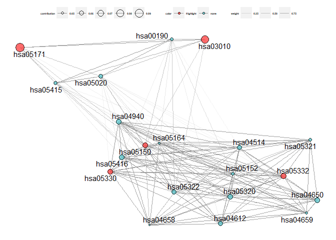

# scPagwas

**scPagwas**, a polygenic principal component-scoring method that links
scRNA-seq data with large-scale GWAS summary statistics to prioritize
genetics-modulated cells associated with complex diseases. **scPagwas**
is able to prioritize disease-associated individual cells by integrating
the scRNA-seq data with polygenic signals from GWAS.


## Installation

You can install the released version of scPagwas from
[github](https://github.com/dengchunyu/scPagwas) with:

``` r
devtools::install_github("dengchunyu/scPagwas")
```

## Example

### 1.Preprogress and create internal storage

``` r
 library(scPagwas)
 suppressMessages(library(Seurat))
 suppressWarnings(library(SOAR))
 suppressMessages(library("dplyr"))
 #Input pathway gene list, you can construct with youself.
 data(Genes_by_pathway_kegg)
 #gene annotation files.
 data(block_annotation)
 #LD data
 data(chrom_ld)

 #1.start to run the wrapper functions for preprogress.
 Pagwas<-scPagwas_main(Pagwas = NULL,
                     gwas_data =system.file("extdata", "GWAS_summ_example.txt", package = "scPagwas"),
                     add_eqtls="OnlyTSS",
                     block_annotation = block_annotation,
                     Single_data = system.file("extdata", "scRNAexample.rds", package = "scPagwas"),
                     Pathway_list=Genes_by_pathway_kegg,
                     chrom_ld = chrom_ld)
 
###########
if(F){
  Pagwas <- list();
  class(Pagwas) <- 'Pagwas'

        Single_data=readRDS(Single_data)
   
    Pagwas <- Single_data_input(Pagwas=Pagwas,
                                Single_data=Single_data,
                                Pathway_list=Pathway_list)

      Pagwas <- Pathway_pcascore_run(Pagwas=Pagwas,#n.cores=n.cores,
                                 Pathway_list=Pathway_list
                                 )
      suppressMessages(gwas_data <- as.data.frame(readr::read_table2(gwas_data)))

     Pagwas <- GWAS_summary_input(Pagwas=Pagwas,
                                  gwas_data=gwas_data
                                  )

       snp_gene_df<-Snp2Gene(snp=Pagwas$gwas_data,
                             refGene=block_annotation
                             )
       snp_gene_df$slope <- rep(1,nrow(snp_gene_df))
       snp_gene_df <- snp_gene_df[snp_gene_df$Disstance=="0",]
       Pagwas$snp_gene_df<-snp_gene_df

  #3.pathway block data
  message(paste(utils::timestamp(quiet = T), ' ******* 5th: Pathway_annotation_input function start! ********',sep = ''))

    Pagwas <- Pathway_annotation_input(Pagwas=Pagwas,
                                       block_annotation=block_annotation,
                                       n.cores=n.cores)
    Pagwas <- Link_pathway_blocks_gwas(Pagwas=Pagwas,
                                       chrom_ld=chrom_ld,
                                       n.cores=n.cores)

}
```

### 2.Get the heritability_contributions for Cell types

``` r
 Pagwas<-Celltype_heritability_contributions(Pagwas,iters = 200)
 names(Pagwas)
```

#### Visualize the celltypes results.

1.barplot

``` r
Bootstrap_P_Barplot(Pagwas=Pagwas,
                    figurenames = NULL,
                    width = 5,
                    height = 7,
                    do_plot=T,
                    title = "Test scPagwas")
```


2.Forestplot for estimate values

``` r
Bootstrap_estimate_Plot(Pagwas=Pagwas,
                        figurenames = NULL,
                        width = 9,
                        height = 7,
                        do_plot=T)
```


    #> TableGrob (1 x 13) "arrange": 2 grobs
    #>   z         cells    name           grob
    #> 1 1 ( 1- 1, 1-10) arrange gtable[layout]
    #> 2 2 ( 1- 1,11-11) arrange gtable[layout]

#### pathway network

``` r
suppressMessages(require("WGCNA"))
suppressMessages(require("patchwork"))
suppressMessages(require("tidygraph"))
suppressMessages(require("ggraph"))
suppressMessages(require("igraph"))
#check the objects
plot_pathway_contribution_network(
                  mat_datExpr=Pagwas$pca_cell_df,
                  vec_pathwaycontribution=Pagwas$Pathway_block_heritability,
                  vec_pathways_highlight=names(sort(Pagwas$Pathway_block_heritability,decreasing = T)[1:5]),
                  n_max_pathways=20,
                  igraph_algorithm = "drl",
                  fontface_labels="bold.italic",
                  color_edge = "#9D9D9D",
                  fontSize_label_lg=4,
                  fontSize_legend_lg=4,
                  fontSize_legend_xlg=4,
                  edge_thickness = 1,
                  do_plot=T
                  
  )
```


\#\#\#\#\#\#\#

### 3.Single cell function

scPagwas_main is a function wrapper other process codes. as the
parameters are the same as Pagwas_main,we can inherit the Pagwas reuslt
for save time.

``` r
Pagwas<-Singlecell_heritability_contributions(Pagwas,
                                              iters = 200,
                                              n.cores=1,
                                              part = 0.5)
```

#### Visualize the scPagwas_main results.

##### Visualize the scPagwas_score of single cell data in UMAP or TSNE plot.

``` r
 require("RColorBrewer")
 require("Seurat")
 require("SeuratObject")
 require("ggsci")
 #check the objects
 Objects()
#>  [1] "block_annotation"        "CT_Pathway_ld_gwas_data"
#>  [3] "data_mat"                "dim_data_mat"           
#>  [5] "dim_pca_scCell_mat"      "dim_raw_data_mat"       
#>  [7] "FBM_raw_data_mat"        "merge_scexpr"           
#>  [9] "Pagwas"                  "Pathway_ld_gwas_data"   
#> [11] "pca_cell_df"             "pca_scCell_mat"         
#> [13] "raw_data_mat"            "scCounts"               
#> [15] "snp_gene_df"
 scRNAexample<-readRDS(system.file("extdata", "scRNAexample.rds", package = "scPagwas"))
 scPagwas_Visualization(scPagwas_score = Pagwas$scPagwas_score,
                        Single_data = scRNAexample,
                        Reduction = TRUE,
                        assay = "SCT",
                        cellpercent = 0.1,
                        filename = NULL,
                        FigureType = "tsne",
                        width = 7,
                        height = 7,
                        lowColor = "#FFBC80", highColor = "#FC4F4F",
                        size = 1,
                        title = "scPagwas_score",
                        do_plot = T)
```


##### Plot the barplot of the proportion of positive Cells in celltypes

``` r
library("RColorBrewer")
library("ggplot2")

scPagwas_score <- Pagwas$scPagwas_score[intersect(colnames(scRNAexample),names(Pagwas$scPagwas_score))]
scRNAexample$scPagwas_score <- scPagwas_score
thre <- sort(scRNAexample$scPagwas_score, decreasing = T)[ncol(scRNAexample) * 0.1]
scRNAexample$positiveCells<-rep(0,ncol(scRNAexample))
scRNAexample$positiveCells[scRNAexample$scPagwas_score>=thre]<-1

plot_bar_positie_nagtive(seurat_obj=scRNAexample,
                              var_ident="positiveCells",
                              var_group="anno",
                              vec_group_colors=NULL,
                              f_color=colorRampPalette(brewer.pal(n=10, name="RdYlBu")),
                              do_plot = T)
```


##### Plot the barplot of the proportion of celltypes in positive Cell

``` r
plot_bar_positie_nagtive(seurat_obj=scRNAexample,
                              var_ident="anno",
                              var_group="positiveCells",
                              vec_group_colors=c("#E8D0B3","#7EB5A6"),
                              do_plot = T)
```


##### Plot the top5 heritability correlation genes in celltypes

``` r
top5genes<-rownames(Pagwas$gene_heritability_correlation)[order(Pagwas$gene_heritability_correlation,decreasing = T)[1:5]]
plot_vln_Corgenes(seurat_obj=scRNAexample,
             assay="RNA", slot="data",
             var_group="anno",
             vec_features=top5genes,
             vec_group_colors= pal_d3(alpha =0.5)(10),
             do_plot = T
             )
```


The workfile is ongoing…
