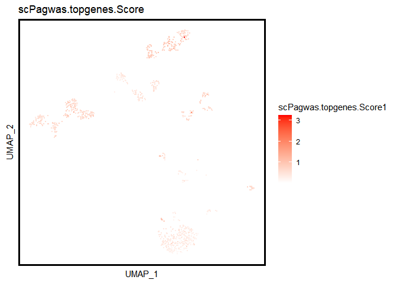
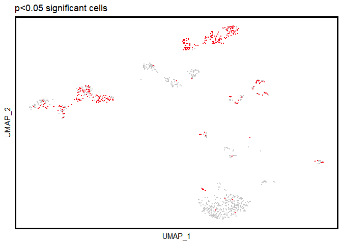
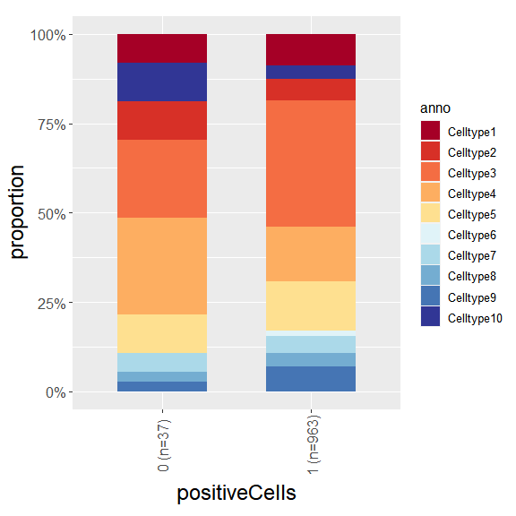
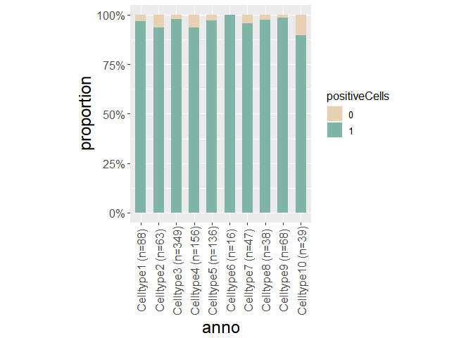
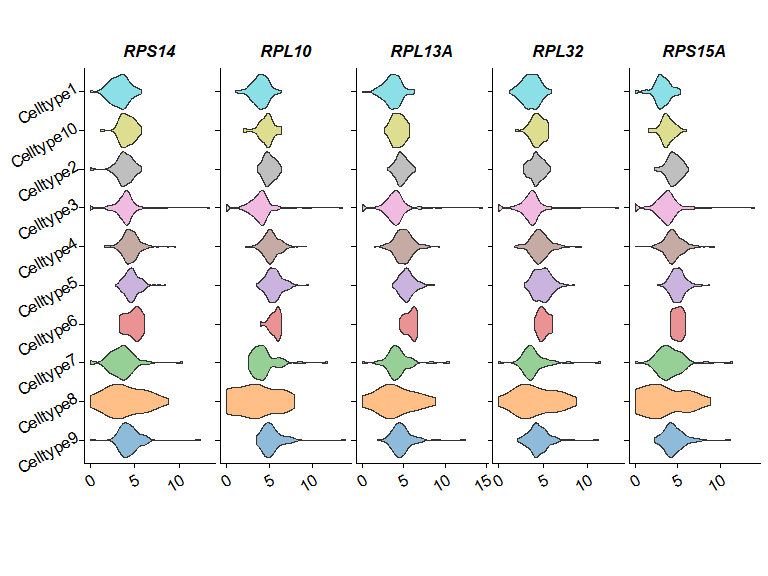

# scPagwas

**scPagwas**, a polygenic principal component-scoring method that links
scRNA-seq data with large-scale GWAS summary statistics to prioritize
genetics-modulated cells associated with complex diseases. **scPagwas**
is able to prioritize disease-associated individual cells by integrating
the scRNA-seq data with polygenic signals from GWAS.


## Installation

You can install the released version of scPagwas from
[github](https://github.com/dengchunyu/scPagwas) with:

``` r
devtools::install_github("dengchunyu/scPagwas")
```

## Example

### 1.Preprogress and create internal storage

``` r
 library(scPagwas)
 library(ggplot2)
 suppressMessages(library(Seurat))
 suppressMessages(library("dplyr"))
 #Input pathway gene list, you can construct with youself.
 data(Genes_by_pathway_kegg)
 #gene annotation files.
 data(block_annotation)
 #LD data
 data(chrom_ld)

 #1.start to run the wrapper functions for preprogress.
 Pagwas_data<-scPagwas_main(Pagwas = NULL,
                     gwas_data =system.file("extdata", "GWAS_summ_example.txt", package = "scPagwas"),
                     Single_data =system.file("extdata", "scRNAexample.rds", package = "scPagwas"),
                     output.prefix="test",
                     output.dirs="scPagwastest_output",
                     block_annotation = block_annotation,
                     assay="RNA",
                     Pathway_list=Genes_by_pathway_kegg,
                     chrom_ld = chrom_ld,
                     singlecell=T,
                     seruat_return=T,
                     celltype=T,
                     ncores = 1)
```

#### Visualize the celltypes results.

1.barplot

``` r
Bootstrap_P_Barplot(p_results=Pagwas_data@misc$bootstrap_results$bp_value[-1],
                    p_names=rownames(Pagwas_data@misc$bootstrap_results)[-1],
                    figurenames = NULL,
                    width = 5,
                    height = 7,
                    do_plot=T,
                    title = "Test scPagwas")
```


#### Visualize the scPagwas_main results.

##### Visualize the scPagwas_score of single cell data in UMAP or TSNE plot.

``` r
 require("RColorBrewer")
 require("Seurat")
 require("SeuratObject")
 require("ggsci")
 #check the objects

 DimPlot(Pagwas_data,group.by = "anno",pt.size=1,reduction="umap",label = T, repel=TRUE)+ 
 umap_theme()+ggtitle("Test")+labs(x="TSNE",y="")+theme(aspect.ratio=1)
```


``` r
 
 
 scPagwas_Visualization(Single_data=Pagwas_data,
                        p_thre = 0.05,
                        FigureType = "umap",
                        width = 7,
                        height = 7,
                        lowColor = "white", 
                        highColor = "red",
                        output.dirs="scPagwastest_output",
                        size = 0.5,
                        do_plot = T)
```



##### Plot the barplot of the proportion of positive Cells in celltypes

``` r
library("RColorBrewer")
library("ggplot2")

plot_bar_positie_nagtive(seurat_obj=Pagwas_data,
                              var_ident="positiveCells",
                              var_group="anno",
                              p_thre = 0.01,
                              vec_group_colors=NULL,
                              f_color=colorRampPalette(brewer.pal(n=10, name="RdYlBu")),
                              do_plot = T)
```



##### Plot the barplot of the proportion of celltypes in positive Cell

``` r
plot_bar_positie_nagtive(seurat_obj=Pagwas_data,
                              var_ident="anno",
                              var_group="positiveCells",
                              vec_group_colors=c("#E8D0B3","#7EB5A6"),
                              do_plot = T)
```



##### Plot the top5 heritability correlation genes in celltypes

``` r
top5genes<-rownames(Pagwas_data@misc$gene_heritability_correlation)[order(Pagwas_data@misc$gene_heritability_correlation,decreasing = T)[1:5]]

plot_vln_Corgenes(seurat_obj=Pagwas_data,
             assay="RNA", slot="data",
             var_group="anno",
             vec_features=top5genes,
             vec_group_colors= pal_d3(alpha =0.5)(10),
             do_plot = T
             )
```



##### Plot the heritability correlated Pathways for each celltypes

``` r
  library(tidyverse)
  library("rhdf5")
 library(ggplot2)
 library(grDevices)
 library(stats)
 library(FactoMineR)
 library(scales)
 library(reshape2)
 library(ggdendro)
 library(grImport2)
 library(gridExtra)
 library(grid)
 library(sisal)

 source(system.file("extdata", "plot_scpathway_contri_dot.R", package = "scPagwas"))

plot_scpathway_dot(Pagwas=Pagwas_data,
                   celltypes=unique(Idents(Pagwas_data))[1:5],
                             topn_path_celltype=5,
                             filter_p=0.05,
                             max_logp=15,
                             display_max_sizes=F,
                             size_var ="logrankPvalue" ,
                             col_var="proportion",
                             shape.scale = 8,
                             cols.use=c("lightgrey", "#E45826"),
                             dend_x_var = "logrankPvalue",
                             dist_method="euclidean",
                             hclust_method="ward.D",
                             do_plot = T,
                             figurenames = NULL,
                             width = 7,
                             height = 7)
```


##### Plot the heritability correlated genes

``` r
heritability_cor_scatterplot(gene_heri_cor=Pagwas_data@misc$gene_heritability_correlation,
                             topn_genes_label=10,
                             color_low="#035397",
                             color_high ="#F32424",
                             color_mid = "white",
                             text_size=2,
                             do_plot=T,
                             max.overlaps =20,
                             width = 7,
                             height = 7)
```

