## the process for some examples, not run and for Record

``` r
###############not run
#' scRNAexample
#'
#' @description
#' A single cell example data from \code{
#' liver_data<-readRDS("/share/pub/qiuf/COVID/liver/Rpoly.rds")
#' #set Idents
#' liver_data@meta.data$annotation <- liver_data@meta.data$anno
#' Idents(liver_data) <- liver_data@meta.data$anno
#' #normalization
#' liver_data <- NormalizeData(liver_data, normalization.method = "LogNormalize", scale.factor = 10000)
#' #correct the cell names, need no specific signal
#' anno <- liver_data@meta.data$annotation
#'  anno<-str_replace_all(anno,"-",".")
#'  anno<-str_replace_all(anno," ",".")
#' anno[which(anno=="Inflammatory.monocyte/macrophages")]<-"Inflammatory.monocyte.macrophages"
#' Celltype_anno$annotation<-str_replace_all(anno,"\\+",".")
#' Idents(liver_data) <- as.factor(anno)
#' liver_data<-subset(liver_data,idents = c("Stellate.cell","unknow","γδ.T.cell"), invert = TRUE)
#' scRNAexample<-liver_data[,sample(ncol(liver_data),1000)]
#'
#'  for (x in 1:length(unique(scRNAexample@meta.data$anno))){
#'  newnames <- paste0("Celltype",x)
#'  oldnames<-unique(scRNAexample@meta.data$anno)[x]
#'  scRNAexample@meta.data$anno[which(scRNAexample@meta.data$anno==oldnames)]<-newnames
#'  }
#'  Idents(scRNAexample)<-scRNAexample@meta.data$anno
#'  scRNAexample@meta.data<-scRNAexample@meta.data[,1:15]
#'
#'  save(scRNAexample,file = "E:/RPakage/scPagwas/data/scRNAexample.RData")
#'
#' }
#'
#' @docType data
#' @name scRNAexample
#' @usage data(scRNAexample)
#' @format a Seruat.
#' @source Generated from PBC
#' @keywords datasets
#' @examples
#' data(scRNAexample)
#' str(scRNAexample)
NULL

#' GWAS_summ_example
#'
#' @description
#' A GWAS summary data from \code{
#' library(readr)
#' library(dplyr)
#' GWAS_liver<-read_delim("/share/pub/mayl/Sherlock/XiangbingYu_Primary_biliary_cholangitis/PBC_GWAS_UKBiobank_summary_final",delim="\t")
#' #select the specific coloumn names: chrom，pos，rsid，beta，se，maf
#' GWAS_liver<-GWAS_liver[,c("CHR","POS","SNP","p","SE")]
#' colnames(GWAS_liver)<-c("chrom","pos","rsid","p","se")
#' COVOD19<-read_delim("/share/pub/mayl/01_COVID19_GWAS_round4/COVID19_HGI_B2_ALL_leave_23andme_20201020.b37.txt",delim="\t")
#' COVOD19<-COVOD19[,c("all_meta_AF","rsid")]
#' colnames(COVOD19)<-c("maf","rsid")
#' ##get beta
#' GWAS_liver$beta<-GWAS_liver$se*qchisq(GWAS_liver$p,1,lower.tail=F)
#' GWAS_liver_inner <- inner_join(GWAS_liver,COVOD19,by="rsid")
#' GWAS_liver_inner <- as.data.frame(GWAS_liver_inner)
#' GWAS_summ_example <- as.data.frame(GWAS_liver_inner[sample(nrow(GWAS_liver_inner),10000),])
#' save(GWAS_summ_example,file="/share/pub/dengcy/GWAS_Multiomics/pagwas/data/GWAS_summ_example.RData")
#' }
#'
#' @docType data
#' @name GWAS_summ_example
#' @usage data(GWAS_summ_example)
#' @format a data.frame.
#' @source Generated from PBC_GWAS_UKBiobank_summary_final
#' @keywords datasets
#' @examples
#' data(GWAS_summ_example)
#' str(GWAS_summ_example)
NULL
```

# 1. Data progress（not run）

导入单细胞数据并对数据进行预处理，要求为标准化后的数据，assays
包含RNA或者SCT，Idents必须为细胞类型的注释。
为了后续可视化方便需要对单细胞进行降维处理，包括TSNE和UMAP降维方式。

``` r
 library(scPagwas)
 library(Seurat)
 library(parallel)
#library(SeuratData)
data(Genes_by_pathway_kegg)
gene annotation files.
data(block_annotation)
LD data
data(chrom_ld)
Single_data =readRDS("E:/RPakage/scPagwas/inst/extdata/GSE138852_ad.rds")
Single_data <- FindVariableFeatures(Single_data,nfeatures = 3000)
Single_data <- NormalizeData(Single_data, normalization.method = "LogNormalize", scale.factor = 10000)
Single_data <- ScaleData(Single_data)
Single_data <- RunPCA(object = Single_data, assay = "RNA", npcs = 50)
Single_data <- RunTSNE(object = Single_data,assay =  "RNA", reduction = "pca",dims = 1:50)
Single_data <- RunUMAP(object = Single_data, assay = "RNA", reduction = "pca",dims = 1:50)
save(Single_data,file = "E:/RPakage/scPagwas/inst/extdata/GSE138852_ad.rds")
```

# 1.Main functions

``` r
 ##############真实例子：
Pagwas<-scPagwas_main(Pagwas = NULL,
                    gwas_data ="E:/RPakage/scPagwas/inst/extdata/AD_prune_gwas_data.txt",
                   output.prefix="adPrunetest",
                    add_eqtls="OnlyTSS",
                   block_annotation = block_annotation,
                   assay="RNA",
                   Single_data ="E:/RPakage/scPagwas/inst/extdata/GSE138852_ad.rds",
                   split_n=1,
                   ncores=5,
                   Pathway_list=Genes_by_pathway_kegg,
                  chrom_ld = chrom_ld,
                  SimpleResult=F)
```

导入结果，去掉结果中无用的list，减少内存消耗

``` r
load("E:/OneDrive/GWAS_Multiomics/ad_test/5.6test/Pagwas_GSE138852_Prune_adsubset_kegg.RData")
Pagwas[c("Pathway_ld_gwas_data","VariableFeatures","merge_scexpr",
             "rawPathway_list",
             "snp_gene_df")]<-NULL
names(Pagwas)
#>  [1] "Celltype_anno"                 "data_mat"                     
#>  [3] "Pathway_list"                  "pca_scCell_mat"               
#>  [5] "pca_cell_df"                   "Pathway_sclm_results"         
#>  [7] "Pathway_lm_results"            "lm_results"                   
#>  [9] "bootstrap_results"             "CellsrankPvalue"              
#> [11] "scPathways_rankPvalue"         "scPagwas_score"               
#> [13] "gene_heritability_correlation" "Pathway_single_results"
```

# Visualize the result

## Visualize the scPagwas_score for single cell

首先产生单细胞单纯映射细胞类型位置和颜色

``` r
 require("RColorBrewer")
 require("Seurat")
 require("SeuratObject")
 require("ggsci")
library("RColorBrewer")
library("ggplot2")
 library(scPagwas)
 library(Seurat)

##导入开头处理的单细胞数据
Single_data =readRDS("E:/RPakage/scPagwas/inst/extdata/GSE138852_ad.rds")

scPagwas_p<-Pagwas$CellsrankPvalue$pValueHigh
names(scPagwas_p)<-rownames(Pagwas$CellsrankPvalue)
sum(scPagwas_p<0.05)
#pdf("E:/OneDrive/GWAS_Multiomics/ad_test/5.6test/ad_pruneGSE138852/tsne_test_ad.pdf")
DimPlot(Single_data,reduction="tsne",group.by = "oupSample.cellType",pt.size=0.8,
        label = TRUE, repel=TRUE)+ labs(x="TSNE",y="")+
        scale_color_d3() +
        theme(aspect.ratio=1)
```

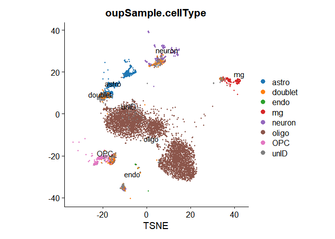

``` r
#dev.off()
```

之后产生两者单细胞降维可视化图，第一张为scPagwas_score得分映射，第二章为阳性细胞映射

``` r
setwd("E:/OneDrive/GWAS_Multiomics/ad_test/5.6test")
 scPagwas_Visualization(scPagwas_score = Pagwas$scPagwas_score,
                                   scPagwas_p=scPagwas_p,
                                   Single_data=Single_data,
                                   p_thre = 0.05,
                                   filename = "ad_pruneGSE138852",
                                   FigureType = "tsne",
                                   width = 7,
                                   height = 7,
                                   lowColor = "#000957", highColor = "#EBE645",
                                   size = 0.5,
                                   title = "scPagwas_score",
                                   do_plot = T)
```

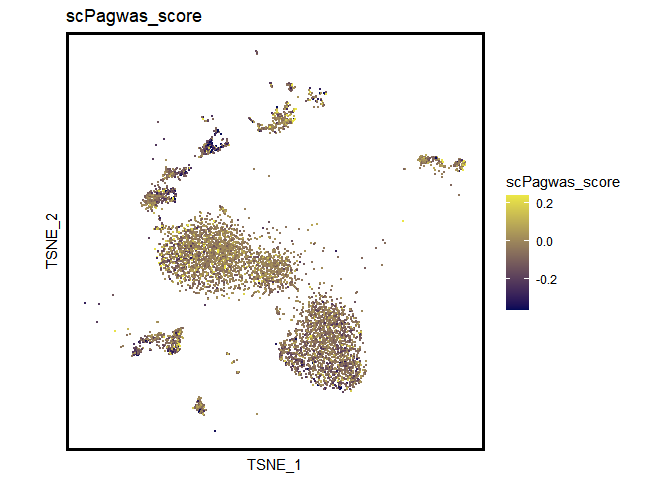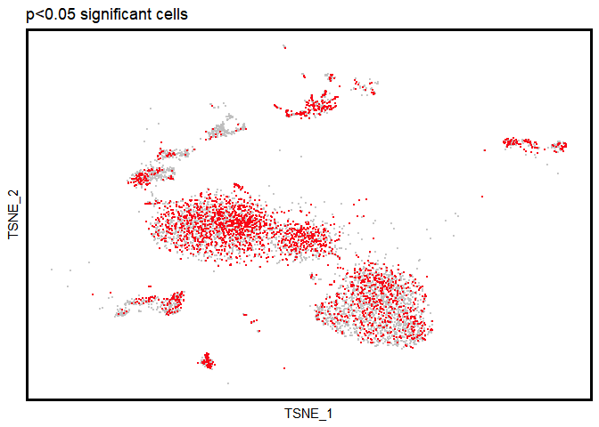

## positive cell percent

### 阳性细胞和阴性细胞中不同细胞类型的比例

``` r
Single_data$scPagwas_p <- scPagwas_p[intersect(colnames(Single_data),names(scPagwas_p))]
#thre <- sort(Single_data$scPagwas_score, decreasing = T)[ncol(Single_data) * 0.1]
Single_data$positiveCells<-rep(0,ncol(Single_data))
Single_data$positiveCells[Single_data$scPagwas_p<0.05]<-1
table(Single_data$positiveCells)
#pdf("E:/OneDrive/GWAS_Multiomics/ad_test/5.6test/ad_pruneGSE138852/bar_positiveCells.pdf")
plot_bar_positie_nagtive(seurat_obj=Single_data,
                              var_ident="positiveCells",
                              var_group="oupSample.cellType",
                              vec_group_colors=NULL,
                              f_color=colorRampPalette(brewer.pal(n=10, name="RdYlBu")),
                              do_plot = T)
```

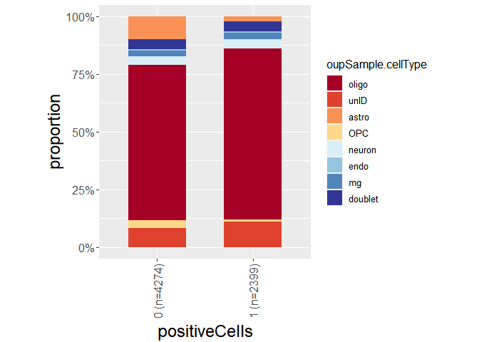

### 不同细胞类型中阳性细胞和阴性细胞的比例

``` r
#pdf("E:/OneDrive/GWAS_Multiomics/ad_test/5.6test/ad_pruneGSE138852/bar_positiveCells_celltypes.pdf")
plot_bar_positie_nagtive(seurat_obj=Single_data,
                              var_ident="oupSample.cellType",
                              var_group="positiveCells",
                              vec_group_colors=c("#E8D0B3","#7EB5A6"),
                              do_plot = T)
```

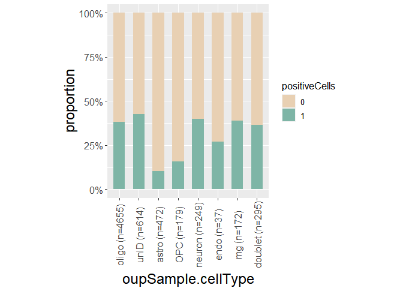

子函数：获得单细胞数据的meta数据以及降维坐标

``` r
fortify.Seurat <- function(x){
  
  xy <- as.data.frame(Embeddings(x, reduction = "umap"))
  colnames(xy) <- c("UMAP_1", "UMAP_2")
  xy$UMAP_1 <- as.numeric(xy$UMAP_1)
  xy$UMAP_2 <- as.numeric(xy$UMAP_2)

  xy2 <- as.data.frame(Embeddings(x, reduction = "tsne"))
  colnames(xy2) <- c("TSNE_1", "TSNE_2")
  xy2$TSNE_1 <- as.numeric(xy2$TSNE_1)
  xy2$TSNE_2 <- as.numeric(xy2$TSNE_2)
  xy<-cbind(xy,xy2)
  return(cbind(xy, as.data.frame(x@meta.data)))
}
all_fortify_can <- fortify.Seurat(Single_data)
```

## 计算伪时间数据（去掉）

``` r
library(slingshot)
library(SingleCellExperiment)
library(mclust, quietly = TRUE)
library(ggpubr)

data_mat_sce<-SingleCellExperiment(assays = List(data =Pagwas$data_mat ))
#Single_data#_opc<-  subset(Single_data, idents = c("OPC","mg"))

rd1<-all_fortify_can[,c("UMAP_1" , "UMAP_2")]
cl1 <- Mclust(rd1)$classification
colData(data_mat_sce)$GMM <- cl1

data_mat_sce<-  SingleCellExperiment(assays = List(data= GetAssayData(object =Single_data, slot = "data")),
                                   reducedDims = SimpleList(UMAP = as.matrix(rd1)),
                                    colData = data.frame(GMM = cl1))

Slingshot_mat <- slingshot(data_mat_sce,
                 clusterLabels = 'GMM',
                 reducedDim = 'UMAP'
                 )
slingPseudotime_df<-as.data.frame(Slingshot_mat@colData[names(Slingshot_mat@colData)[c(-1,-2)]])

slingPseudotime<-apply(slingPseudotime_df, 1, function(x)  mean(x,na.rm =T))
colors <- colorRampPalette(brewer.pal(11,'Spectral')[-6])(100)
 pdf("E:/OneDrive/GWAS_Multiomics/ad_test/5.6test/ad_pruneGSE138852/Slingshot.plot.pdf")
 plotcol <- colors[cut(slingPseudotime, breaks=100)]
 plot(reducedDims(Slingshot_mat)$UMAP, col = plotcol,
      pch=16, asp = 1)
 lines(SlingshotDataSet(Slingshot_mat), lwd=2, col='black')
 dev.off()
```

## 计算通路数据降维结果

将通路结果矩阵设置成为Seurat变量格式方便后面利用seurat包中的函数进行类单细胞数据处理。

``` r
#Pagwas$Pathway_single_results
Pagwas$Celltype_anno$scPagwas_score<-Pagwas$scPagwas_score
Pagwas$Celltype_anno$pValueHigh <-Pagwas$CellsrankPvalue$pValueHigh
#Pagwas$Celltype_anno$slingPseudotime<- slingPseudotime[rownames(Pagwas$Celltype_anno)]

Pagwas_pca<-as.data.frame(t(data.matrix(Pagwas$Pathway_single_results)))

Pagwas_pca <- do.call(data.frame,                      # Replace Inf in data by NA
                   lapply(Pagwas_pca,
                          function(x) replace(x, is.infinite(x), NA)))
Pagwas_pca<- t(na.omit(t(Pagwas_pca)))
rownames(Pagwas_pca)<-colnames(Pagwas$Pathway_single_results)

Pagwas_seu<-CreateSeuratObject(
  Pagwas_pca,
  project = "CreateSeuratObject",
  assay = "RNA",
  names.field = 1,
  names.delim = "_",
  meta.data = Pagwas$Celltype_anno[colnames(Pagwas_pca),]
)

Idents(Pagwas_seu)<-Pagwas_seu$annotation
#ls_scCell_markerpa <- FindAllMarkers(object = ls_scCell)
#Pagwas_seu$slingPseudotime<-slingPseudotime[colnames(Pagwas_seu)]
  
Pagwas_seu<-ScaleData(Pagwas_seu)
Pagwas_seu <- FindVariableFeatures(object = Pagwas_seu,nfeatures = round(dim(Pagwas_seu)[1]*0.2))

Pagwas_seu <- RunPCA(object = Pagwas_seu, assay = "RNA", features = VariableFeatures(Pagwas_seu), npcs = 30)
Pagwas_seu <- RunTSNE(object = Pagwas_seu,assay = "RNA", reduction = "pca", dims = 1:30)
Pagwas_seu <- RunUMAP(object = Pagwas_seu, assay ="RNA", reduction = "pca", dims = 1:30)
```

### 可视化通路降维数据中不同细胞类型的分布

``` r
Pagwas_fortify <- fortify.Seurat(Pagwas_seu)
#  pdf("E:/OneDrive/GWAS_Multiomics/ad_test/5.6test/ad_pruneGSE138852/Slingshot.plot.pdf")
DimPlot(Pagwas_seu,group.by = "annotation",label = F)+ #umap_theme()+ ggtitle("annotation")+
        theme(aspect.ratio=1)
```

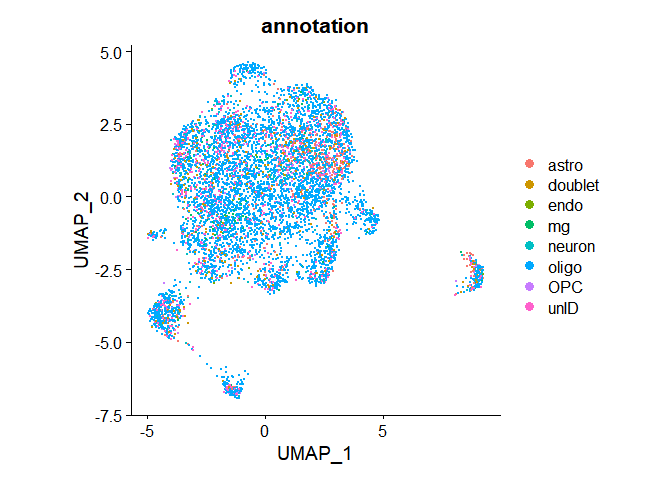

``` r
#  dev.off()
```

## 通路数据降维可视化scPagwas_score映射

``` r
umap_theme <- function(){
  theme_grey() %+replace%
    theme(panel.background = element_rect(fill = "white", colour = "white", size = 0.1),
          axis.text.x  = element_blank(),
          axis.ticks.x = element_blank(),
          axis.text.y  = element_blank(),
          axis.ticks.y = element_blank(),
          panel.grid.major = element_blank(),
          panel.grid.minor = element_blank(),
          legend.key=element_blank())
}

plot1 <- ggplot() +
        geom_point(data = Pagwas_fortify,
                   aes(x = UMAP_1, y = UMAP_2,color =scPagwas_score), size = 0.6, alpha = 1) +
        umap_theme() +
        scale_colour_gradient2(low="#8479E1",mid="#F7F5F2",high="#FD5D5D")+
        theme(aspect.ratio=1) +
        guides(colour = guide_legend(override.aes = list(size=3)))

#pdf("E:/OneDrive/GWAS_Multiomics/ad_test/5.6test/ad_pruneGSE138852/umap_opc_scPagwas_score.pdf")
  print(plot1)
```

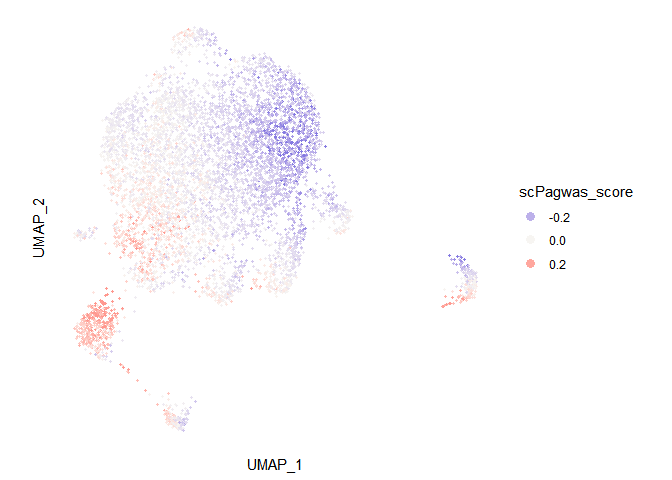

``` r
#dev.off()
```

## 通路数据降维可视化阳性细胞映射

``` r
  Pagwas_fortify$p_thre<-rep("non",nrow(Pagwas_fortify))
  Pagwas_fortify$p_thre[which(Pagwas_fortify$pValueHigh<0.05)]<-"<0.05"
plot2 <-  ggplot() +
        geom_point(data = Pagwas_fortify,
                   aes(x = UMAP_1, y = UMAP_2,color =p_thre), size =0.6, alpha = 1) +
        umap_theme() +
        scale_color_manual(values = c("non" = "#05595B", "<0.05" = "#E45826"))+
        theme(aspect.ratio=1) +
        guides(colour = guide_legend(override.aes = list(size=3)))

#pdf("E:/OneDrive/GWAS_Multiomics/ad_test/5.6test/ad_pruneGSE138852/umap_opc_scPagwas_p.pdf")
  print(plot2)
```

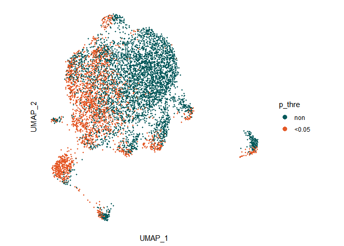

``` r
#  dev.off()
  
```

## 可视化遗传基因的映射

``` r
###可选择
gene<-"MAP2K2"
Pa<-"hsa04630"

data_mat<-Pagwas$data_mat[,rownames(Pagwas_fortify)]
pca_scCell_mat<-Pagwas$pca_scCell_mat[,rownames(Pagwas_fortify)]

Pagwas_fortify$gene<-as.vector(data_mat[gene,])
Pagwas_fortify$Pa<-as.vector(pca_scCell_mat[Pa,])

plot3 <-  ggplot() +
        geom_point(data = Pagwas_fortify,
                   aes(x = UMAP_1, y = UMAP_2,color =gene), size =0.6, alpha = 1) +
        umap_theme() +
        scale_colour_gradient2(low="#8479E1",mid="#F7F5F2",high="#FD5D5D")+
        theme(aspect.ratio=1) +
        guides(colour = guide_legend(override.aes = list(size=3)))+
        labs(title = gene)
#pdf("E:/OneDrive/GWAS_Multiomics/ad_test/5.6test/ad_pruneGSE138852/umap_opc_scPagwas_p.pdf")
  print(plot3)
```

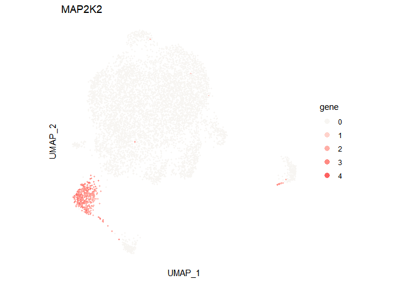

``` r
#  dev.off()
  
  plot4 <-  ggplot() +
        geom_point(data = Pagwas_fortify,
                   aes(x = UMAP_1, y = UMAP_2,color =Pa), size =0.6, alpha = 1) +
        umap_theme() +
        scale_colour_gradient2(low="#8479E1",mid="#F7F5F2",high="#FD5D5D")+
        theme(aspect.ratio=1) +
        guides(colour = guide_legend(override.aes = list(size=3)))+
        labs(title = Pa)
#pdf("E:/OneDrive/GWAS_Multiomics/ad_test/5.6test/ad_pruneGSE138852/umap_opc_scPagwas_p.pdf")
  print(plot4)
```

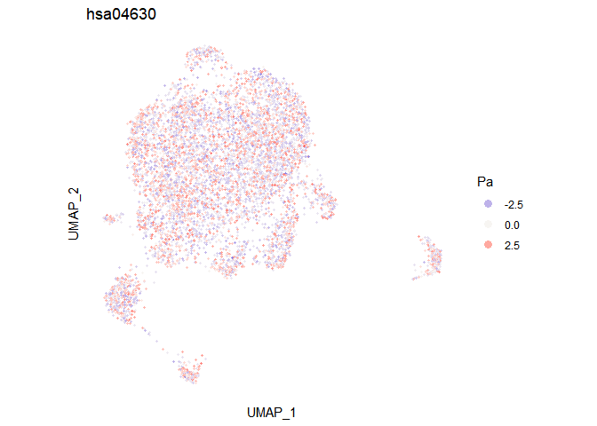

## 通路数据降维可视化伪时间（去掉）

``` r
#Pagwas_fortify2<-Pagwas_fortify
#Pagwas_fortify2$slingPseudotime[Pagwas_fortify2$slingPseudotime>25] <-25
plot3 <-  ggplot() +
        geom_point(data = Pagwas_fortify,
                   aes(x = UMAP_1, y = UMAP_2,color =slingPseudotime), 
                   size = 0.5, alpha = 1) +
        umap_theme() +
        scale_colour_gradient2(low="#8479E1",mid="#F7F5F2",high="#FD5D5D",midpoint = median(Pagwas_fortify$slingPseudotime))+
        theme(aspect.ratio=1) +
        guides(colour = guide_legend(override.aes = list(size=3)))
pdf("E:/OneDrive/GWAS_Multiomics/ad_test/5.6test/ad_pruneGSE138852/umap_opc_slingPseudotime.pdf")
  print(plot3)
  dev.off()
  
Pagwas_fortify$logpValueHigh<- -log10(Pagwas_fortify$pValueHigh)

#lapply(unique(Pagwas_fortify$annotation),function(ss){
  
plot4 <- ggplot(Pagwas_fortify,aes(x =logpValueHigh ,
                y =slingPseudotime ))+
          geom_point(color="#676FA3",size=0.5)+
          geom_smooth(se = F,
                      color = "#8E0505")+
          labs(x = "logpValueHigh",y="slingPseudotime",title=ss)+
          theme_classic()+
          ggpubr::stat_cor(data =Pagwas_fortify,
           method = "spearman")
pdf("E:/OneDrive/GWAS_Multiomics/ad_test/5.6test/ad_pruneGSE138852/cor_scPagwas_slingPseudotime.pdf")
  print(plot4)
  dev.off()
#})
head(Pagwas_fortify)

library(ggpubr)
library(hrbrthemes)
#####箱式图
Pagwas_fortify$p_thre0.001<-rep("non",nrow(Pagwas_fortify))
Pagwas_fortify$p_thre0.001[Pagwas_fortify$pValueHigh<0.001]<-"<0.001"


p_integrate<- ggplot(Pagwas_fortify,aes(x=p_thre0.001,y=slingPseudotime,fill=p_thre0.001))+
  geom_boxplot(outlier.size = 0.6,alpha=0.6)+ #箱式图异常值大小调整
    scale_fill_manual(breaks=c("non","<0.05"), #图例顺序调整
                      values=c("#9ad3bc","#f3eac2"))+ #填充颜色调整
    geom_signif(comparisons=list(c("non","<0.05")),
      map_signif_level=c("***"=0.001, "**"=0.01, "*"=0.05), #展示显著性
      textsize=2,tip_length=0.03)+
    geom_jitter(color="black" ,size=0.89,alpha=0.5)+theme(legend.position="none")+ #不需要图例
    theme_ipsum_rc(base_family = "" )+facet_wrap(~Gene,scale="free",ncol=4)
file_n<-paste0(cell,"_KeyGene_DExpression.pdf")
pdf(file_n,height = 14)
p_integrate
dev.off()
```

## 可视化通路基因网络图

选择感兴趣的细胞类型和通路，进行网络可视化

``` r
suppressMessages(require("WGCNA"))
suppressMessages(require("patchwork"))
suppressMessages(require("tidygraph"))
suppressMessages(require("ggraph"))
suppressMessages(require("igraph"))
source("E:/RPakage/visulizeplotR/plot_pathway_contribution_network.R")
require("ggsci")
require("graphlayouts")

#check the objects
rownames(Pagwas$scPathways_rankPvalue)<-colnames(Pagwas$Pathway_sclm_results)
celltypes="OPC"
pathways<-rownames(Pagwas$scPathways_rankPvalue)[order(Pagwas$scPathways_rankPvalue[,"OPC"],decreasing = F)[1:5]]

pathways<-c("hsa00250","hsa04630","hsa04666","hsa00100","hsa00020")
#hsa00250 Pathway : Name: Alanine, aspartate and glutamate metabolism; Metabolism; Amino acid metabolism BRITE hierarchy.
#hsa04630:Name: JAK-STAT signaling pathway - Homo sapiens (human) Description: The Janus kinase/signal transducers and activators of transcription (JAK/STAT) pathway is one of a handful of pleiotropic cascades used to transduce a multitude of signals for development 
#hsa04666: hsa04666 Pathway : Name: Fc gamma R-mediated phagocytosis - Homo sapiens (human) Description: Phagocytosis plays an essential role in host-defense mechanisms through the uptake and destruction of infectious pathogens. Specialized cell types including macrophages, neutrophils, and monocytes take part in this process in higher organisms.
#hsa00100: Glycolysis, core module involving three-carbon compounds 
#hsa00020 Pathway : Name: Citrate cycle (TCA cycle) - Homo sapiens (human) Description: The citrate cycle (TCA cycle, Krebs cycle) is an important aerobic pathway for the final steps of the oxidation of carbohydrates and fatty acids. 
#extrafont::font_import()
library(extrafont)
loadfonts()
lapply(1:length(pathways),function(ss){
 
  pathway<-pathways[ss]
 # library(showtext)
 #fond_add('Arial Narrow','/Library/Fonts/ArialNarrow.tiff')
# pdf(paste0("E:/OneDrive/GWAS_Multiomics/ad_test/5.6test/ad_pruneGSE138852/",pathway,"_pthway_network.pdf"))
plot_pathway_contribution_network(mat_datExpr=Single_data@assays$RNA@data, gene_contribution=Pagwas$gene_heritability_correlation,
                                  Celltype_anno=Pagwas$Celltype_anno,
                                  Pathway_list=Pagwas$Pathway_list,
                                  celltypes="OPC",
                                  pathwat_select=pathway,
                                        pathways_thre=0.05,
                                        adjacency.power=4,
                                        n_max_genes=100,
                                        #edge_filter=0.00015,
                                        text_topn=10,
                                        igraph_algorithm = "drl",
                                        h_method = "complete",
                                        fontface_labels="bold.italic",
                                        color_edge = "#9D9D9D",
                                        color_group=pal_d3(alpha =0.5)(5)[ss],
                                        node_alpha=0.8,
                                        fontSize_label_lg=2,
                                        fontSize_legend_lg=3,
                                        fontSize_legend_xlg=3,
                                        limits=c(-0.1,0.1),
                                  range=c(1,7),
                                        edge_thickness = 2,
                                        do_plot=T , #figurenames=paste0("E:/OneDrive/GWAS_Multiomics/ad_test/5.6test/ad_pruneGSE138852/",pathway,"_pthway_network.pdf"),
                                        width=10,
                                        height=10
  )
#dev.off()
})
```

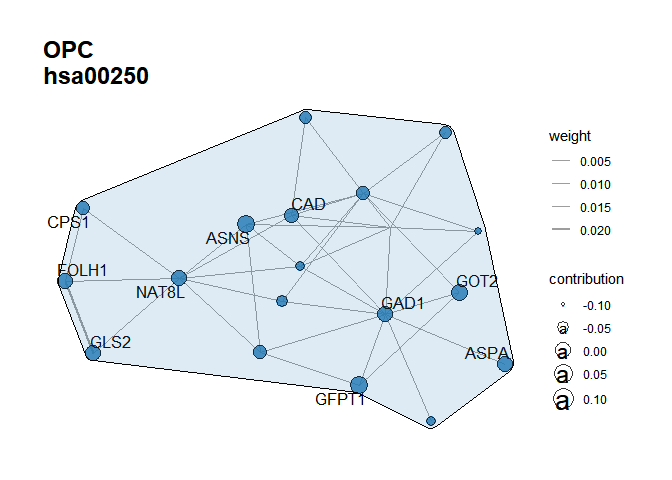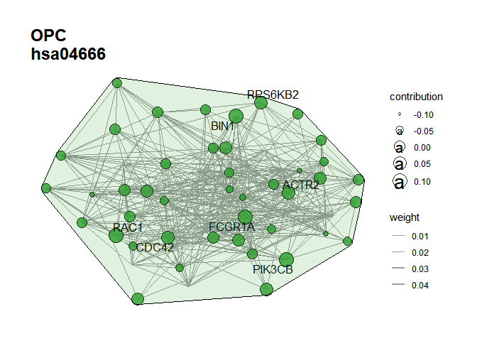

## 可视化细胞类型遗传特异性通路-dotplot

``` r
  library(tidyverse)
  library("rhdf5")
 library(ggplot2)
 library(grDevices)
 library(stats)
 library(FactoMineR)
 library(scales)
 library(reshape2)
 library(ggdendro)
 library(grImport2)
 library(gridExtra)
 library(grid)
 library(sisal)
source("E:/RPakage/visulizeplotR/plot_scpathway_contri_dot.R")
plot_scpathway_dot(Pagwas=Pagwas,
                   topn_path_celltype=5,
                   filter_p=0.05,
                   max_logp=8,
                   display_max_sizes=F,
                   size_var = "lm_beta",
                   col_var="logrankPvalue",
                   shape.scale = 8,
                   cols.use=c("lightgrey", "#E45826"),
                   dend_x_var = "lm_beta",
                   dist_method="euclidean",
                   hclust_method="ward.D",
                   do_plot = T,
                   #figurenames = "E:/OneDrive/GWAS_Multiomics/ad_test/5.6test/ad_pruneGSE138852/pathway_test_dotplot.pdf",
                   width = 12,
                   height = 7)
```


``` r
plot_scpathway_dot(Pagwas=Pagwas,
                   celltypes=unique(Pagwas$Celltype_anno$annotation)[1:5],
                             topn_path_celltype=5,
                             filter_p=0.05,
                             max_logp=10,
                             display_max_sizes=F,
                             size_var = "lm_beta",
                             col_var="logrankPvalue",
                             shape.scale = 8,
                             cols.use=c("lightgrey", "#E45826"),
                             dend_x_var = "lm_beta",
                             dist_method="euclidean",
                             hclust_method="ward.D",
                             do_plot = F,
                             figurenames = NULL,
                             width = 7,
                             height = 7)
```

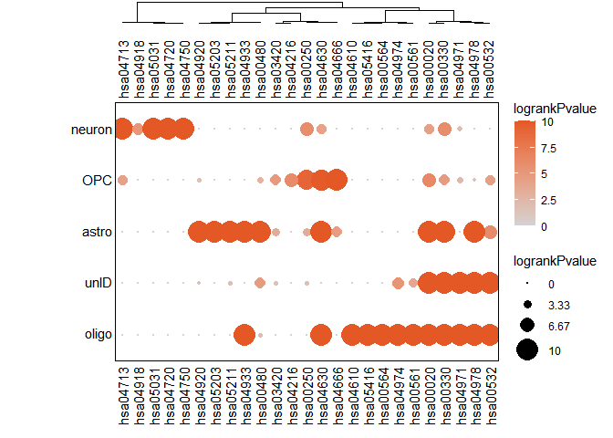

## 可视化基因遗传关联性排秩点图

``` r
source("E:/RPakage/visulizeplotR/heritability_cor_scatterplot.R")

heritability_cor_scatterplot(gene_heri_cor=Pagwas$gene_heritability_correlation,
                                       topn_genes_label=10,
                                       color_low="#035397",
                                       color_high ="#F32424",
                                       color_mid = "white",
                                       text_size=3,
                                       do_plot=T,
                                       #figurenames="E:/OneDrive/GWAS_Multiomics/ad_test/5.6test/ad_pruneGSE138852/test_scatterplot.pdf",
                                       width = 7,
                                       height = 7
)
```

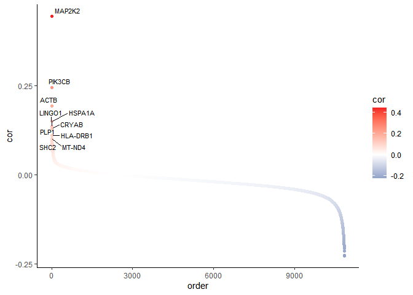

### Plot the top5 heritability correlation genes in celltypes

``` r
top5genes<-rownames(Pagwas$gene_heritability_correlation)[order(Pagwas$gene_heritability_correlation,decreasing = T)[1:5]]
plot_vln_Corgenes(seurat_obj=Single_data,
             assay="RNA", slot="data",
             var_group="oupSample.cellType",
             vec_features=top5genes,
             vec_group_colors= pal_d3(alpha =0.5)(10),
             do_plot = T
             )
```

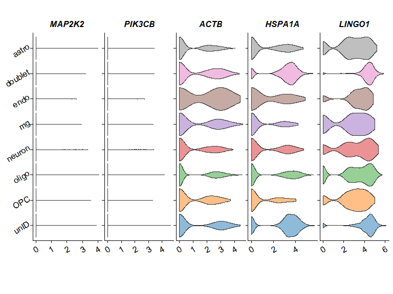

## 可视化细胞类型遗传关联显著性

``` r
#pdf("E:/OneDrive/GWAS_Multiomics/ad_test/5.6test/ad_GSE138852/bar_celltypes.pdf")
Bootstrap_P_Barplot(p_results=Pagwas$bootstrap_results$bp_value[-1],
                                p_names=rownames(Pagwas$bootstrap_results)[-1],
                                title = "ad Test scPagwas",
                                figurenames = NULL,
                                width = 5,
                                height = 7,
                                do_plot=TRUE)
```

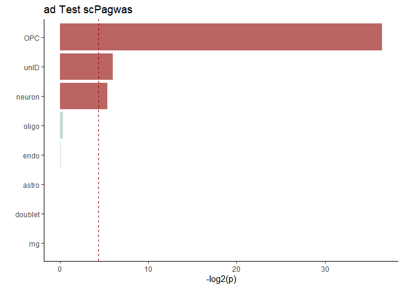

``` r
#dev.off()
Bootstrap_estimate_Plot(Pagwas=Pagwas,
                        figurenames = NULL,
                        width = 9,
                        height = 7,
                        do_plot=T)
```

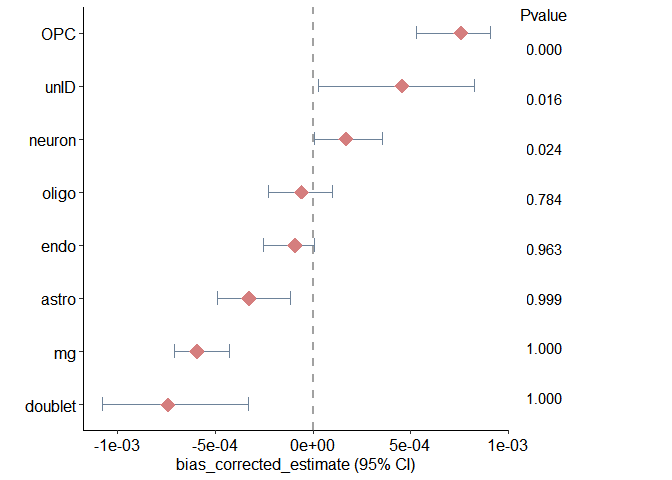
